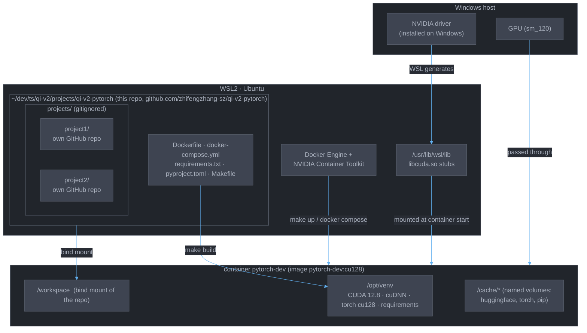
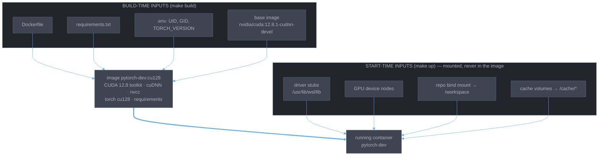

# qi-v2-pytorch

A single reproducible GPU dev environment for all my PyTorch projects.

This repo holds only the environment: the Docker image, compose service,
Makefile wrappers, and shared lint/test config. The actual projects are
separate GitHub repositories, cloned side by side into `projects/<name>/`,
where they share the container, the Python venv, and the tooling. Nothing
under `projects/` is committed here.

```
qi-v2-pytorch/           this repo  (github.com/zhifengzhang-sz/qi-v2-pytorch)
└── projects/
    ├── project1/        its own repo, cloned here
    └── project2/        its own repo, cloned here
```

Targets NVIDIA Blackwell GPUs (sm_120, e.g. RTX 5090) with CUDA 12.8.

## Architecture



- **Environment** (this repo) is built into the image and drives the container.
- **Projects** are separate GitHub repos cloned into `projects/`; they reach the
  container through the bind mount, never through the image.
- **Driver** lives on Windows and is mounted in at start time, never built in.
- **Caches** persist in named volumes across image rebuilds.

## Requirements

- Docker with the [NVIDIA Container Toolkit](https://docs.nvidia.com/datacenter/cloud-native/container-toolkit/latest/install-guide.html)
- An NVIDIA driver that supports CUDA 12.8 or newer (on WSL2 this is the
  Windows driver; see [GPU driver on WSL2](#gpu-driver-on-wsl2))
- Optionally VS Code with the Dev Containers extension

## Quick start

```bash
git clone git@github.com:zhifengzhang-sz/pytorch.git
cd qi-v2-pytorch
cp .env.example .env   # set UID/GID to `id -u` / `id -g` if not 1000
make build             # one-time, downloads several GB
make gpu               # prints torch version and GPU name
make shell             # bash inside the container, repo mounted at /workspace
```

Or open the folder in VS Code and choose **Reopen in Container**.

Then clone your projects into `projects/` (see below). On a new machine that
is the whole setup: clone this repo, clone the projects, `make build`.

## Everyday commands

| Command | What it does |
| --- | --- |
| `make test` | run all tests (`make test T=projects/foo/test_x.py::test_y` for one) |
| `make lint` / `make fmt` | ruff check / ruff format |
| `make jupyter` | JupyterLab on <http://localhost:8888> |
| `make down` | stop the container; caches in named volumes persist |

## Working on a project

Each project is its own git repository, cloned into `projects/<name>/`. That
directory is gitignored here, so a project's code and history live only in its
own remote; this repo tracks just the environment. A project's visibility on
GitHub is independent of this repo's.

```bash
cd projects
git clone git@github.com:<you>/project1.git
git clone git@github.com:<you>/project2.git
```

Inside the container the clones appear at `/workspace/projects/<name>`.
Commit and push each project from its own folder as usual. `make test` and
`make lint` pick up every project automatically; a project should not carry
its own Dockerfile or ruff/pytest config. A per-project `pyproject.toml` is
fine if the project needs to be pip-installable.

## GPU driver on WSL2

### The picture

There are two moments that matter: **build time**, when `make build` produces
the image, and **start time**, when `make up` creates a container from it.
Different things enter at each moment.



The NVIDIA driver is **not** an input to the build. It is installed on
Windows, WSL generates matching stubs under `/usr/lib/wsl/lib`, and the
Container Toolkit mounts those stubs into the container every time it
starts. The image never contains a driver, and no driver package should ever
be installed inside Ubuntu (it would shadow the WSL stubs and break CUDA).

| Layer | Lives in | Enters the container at | Updated by |
| --- | --- | --- | --- |
| NVIDIA driver | Windows | start time (mounted) | Windows driver installer |
| Driver stubs `libcuda.so*` | WSL `/usr/lib/wsl/lib` | start time (mounted) | WSL, automatically |
| CUDA 12.8 toolkit, cuDNN, nvcc | the image | build time | `make build` |
| torch, requirements | the image | build time | `make build` |

`nvidia-smi` in WSL or in the container always reports the Windows driver.

### Consequences

**A Windows driver update does not change the image.** `make build` after a
driver update finds none of its inputs changed and does nothing. What you
need instead is a container restart, so the new stubs are mounted:

```bash
make down && make up
make gpu
```

If `nvidia-smi` inside WSL still shows the old driver, WSL itself is stale:
run `wsl --shutdown` from a Windows terminal, reopen Ubuntu, then `make up`.

**`make build` rebuilds only the layers whose inputs changed.** Docker caches
every Dockerfile step. Editing `requirements.txt` reruns just the final pip
install; the apt packages, venv and the large torch download stay cached.
Changing `UID`/`GID` reruns almost everything, since the user is created
early. Running `make build` with nothing changed is a no-op.

**The one compatibility rule.** The CUDA version the driver supports (top
right of `nvidia-smi`) must be at least the toolkit version in the image
(12.8). Newer drivers are backward compatible, so a driver reporting CUDA
13.x is fine.

### When to run `make build`

| Situation | Rebuild? | What to do |
| --- | --- | --- |
| Edited `requirements.txt` | yes | `make build` |
| Edited `Dockerfile` (new base image, pinned torch) | yes | `make build` |
| Changed `UID`/`GID`/`TORCH_VERSION` in `.env` | yes | `make build` |
| Updated the Windows NVIDIA driver | no | `make down && make up` |
| Updated WSL or Windows | no | `wsl --shutdown`, then `make up` |
| Updated Docker or the Container Toolkit | no | `make down && make up` |
| Want a newer CUDA toolkit than the driver supports | yes, after driver | update Windows driver, check `nvidia-smi`, bump base image, `make build` |
| Want the latest patch of the same base image tag | yes | `docker compose build --pull` |
| Want everything installed fresh, ignoring the cache | yes | `docker compose build --no-cache` |

### If `make gpu` fails

1. `nvidia-smi` in WSL fails → the problem is on the Windows/WSL side: driver
   not installed, WSL out of date, or WSL needs `wsl --shutdown`.
2. `nvidia-smi` works in WSL but not in the container → restart the container;
   if it still fails, check `docker info | grep -i nvidia` shows the `nvidia`
   runtime and reinstall the Container Toolkit.
3. Both work but torch reports no CUDA → the image was built from the wrong
   wheel index or a wrong `TORCH_VERSION`; check `Dockerfile` and rebuild.

## Adding dependencies

Edit `requirements.txt` and run `make build`. Dependencies are shared by every
project, since all of them run in the same venv. Common ML libraries are listed
there commented-out. The venv inside the image is intentionally read-only for
the dev user; use `sudo pip install` only for throwaway experiments.

## Layout

```
projects/<name>/     one clone per project (gitignored; each has its own remote)
data/ checkpoints/   gitignored; keep large artifacts here
requirements.txt     shared Python deps
pyproject.toml       shared ruff + pytest config
```
